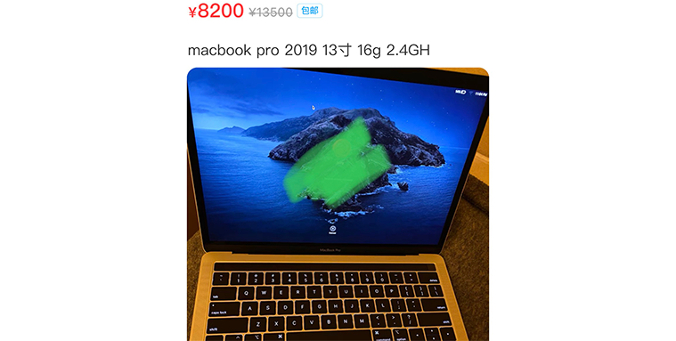
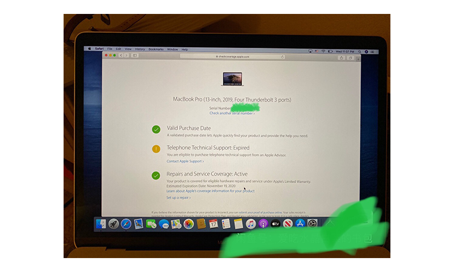
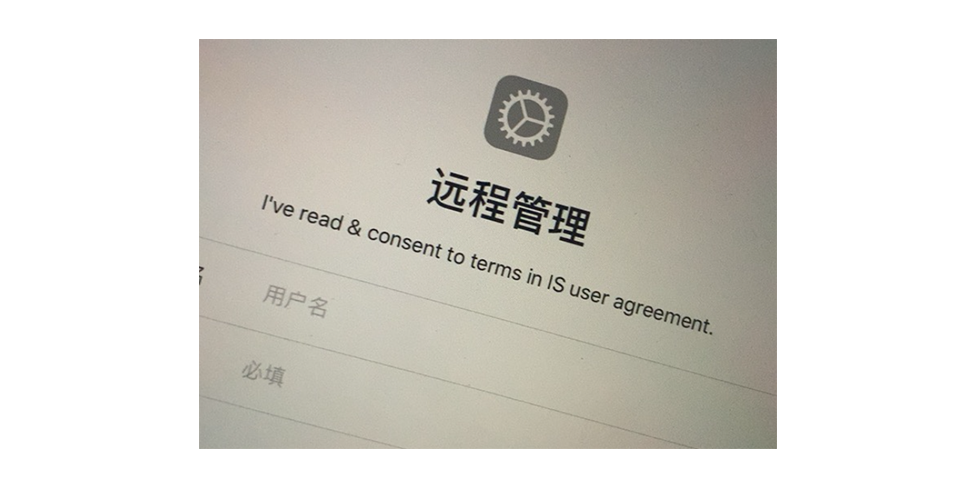
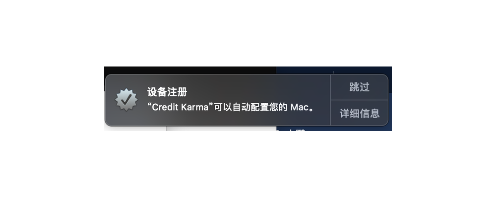
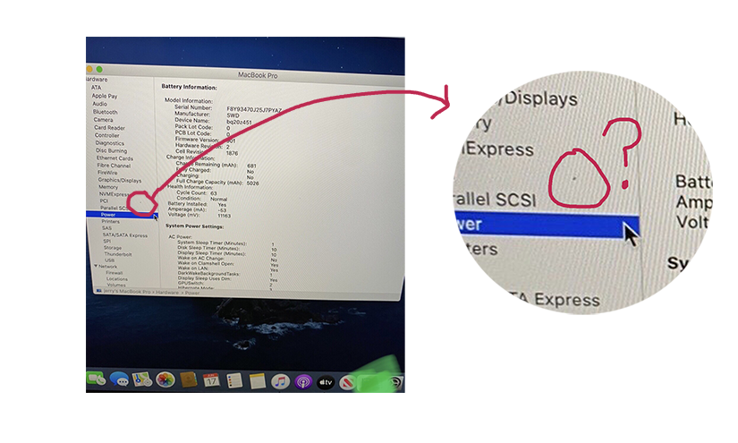
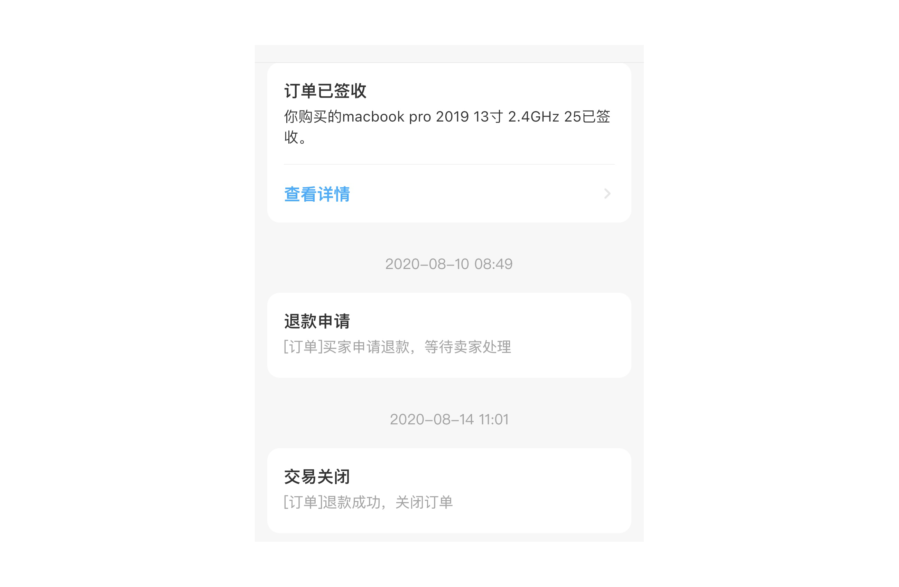

## 事件缘由
2020-07-02
终于再也忍受不了日日被不稳定的黑苹果折磨的日子了,打开某鱼上下滑动着界面，开始努力寻找一款价格便宜，成色娇新的女生自用mac，突然一个macbook pro 2019 13寸 16GB 2.4GHz 出现在眼前，不要14999，不要9999，只要8200元 2.4GHz 在保mac抱回家。

兴高采烈，手舞足蹈，这种好事怎么就被我发现了。展示图片里电脑内的界面还是英文的，看来这机主英语比我好的不是一星半点啊，顿时心生佩服仰慕之情。生怕这好事被别人抢走，说不好既能买到称心的电脑还能交一个英语好的朋友，岂不是美哉。马上点开聊天窗口，一串大炮连环问发了过去。
得到如下结果：
1. 无票无配件，裸机交货；
2. 此机乃是🇺🇸美国机，而且机身现在就在美国，机主下月回国，下月发货（好家伙，此时有点担心这个机器会不会带新冠病毒回来的说）；
3. 机器无拆无修，在保（查了序列号也确实在保）。

果然即要嫩又要骚是不可能的，价格便宜就没箱说票齐全一说，斟酌再三，都问了这么多了，也不好意思不要了，看在还在保更重要的是女生自用的份上，冲！
脑子一热，居然直接拍下了。经过一个月艰辛的等待，这买家也不负众望，安全从米国回到了国内。某鱼app上卖家发来消息，称已在宾馆安顿好，相约微信视频验货后再发货，电话拨过去，在等待接通的片刻，心想女生自用还有啥好验的。电话一接通，我去****的，怎么是个大哥？？？说好的女生自用的？？？顾不了那么多了，摄像头怼到这台“女生自用机”上，开机操作，机内序列号与壳子序列号一致，电池循环也还可以，就发货了。
次日又次日，收到货，用自己的的充电器充上电，屏幕亮起，成功开机，发现appleID是别人的账号。卖出了不应该清除所有数据吗？不怕隐私泄漏吗？找卖家要来密码，成功进入系统，依次检查，键盘没问题（蝶式键盘真的难用），触控板没问题，屏幕没问题（当时很脏），链接WIFI没问题（终于不用忍受我那驱动不了无线网卡的黑苹果了），喇叭话筒摄像头都没问题，整体看下来“应该”没啥问题，正常使用是完全可以的。心想，拥有在某鱼上十多次购买经验的我，果然智慧过人，翻车什么的，不存在滴！
打开奈飞看了两集《纸房子》，这色彩，这杜比，真不错，不过一想这电脑都是自己的了，里边还是别人的账号（越想心里越不爽，一顿妈卖批）。彻底清除数据，重装系统！清除数据，系统重装，一切顺利进行，这样的话，重启之后就跟新的一样，可以新建自己的账号了。
？？？
这是啥，看不懂，Google一下，当时忘记拍照片，大概就是，需要企业用户登陆才能进入系统

WTF！！！
翻车了翻车了，买到企业监管机了，联系卖家，卖家称不知道这是什么情况，不太了解mac的系统
我靠！无奈只能自己想办法，网上搜索一下，折腾了一下，总算顺利进入系统了
怎么折腾的-见这篇文章
正常登入AppleID 其他功能一切正常，“网上说”企业监管机与一般机器并无区别，正常使用即可，那我就正常使用吧。连上网，冲会儿浪！WTF？？？怎么老是跳，显示我这个电脑还被某某某监管可以进行随意配置？？？

神奇的网友又帮输了我，一顿骚操作（见文章：），这个通知被“永久”屏蔽掉了，这下终于可以好好使用了吧，历经千辛万难，终于可以好好使用了。
看剧没问题，接下来用我精致的P图技术，P一下我拍摄的精致风景照吧。额 额 额，这屏幕这么脏，实在看不下去。掏出我刚买的眼镜步，快递都还没拆的崭新的眼镜布，擦在高贵的macbookpro屏幕上，我知道你有涂层，放心我会轻一点的，三下五除二，屏幕已经被我擦的干干净净，放大风景照。
这！这！这！
屏幕上怎么还有个坑，擦也擦不掉，多半是在屏幕里边。

算了算了，这么好的电脑，只是在他高贵的屏幕上有一个不可修复的小坑而已不算什么，不算什么，又不影响使用啦！当然是选择**退掉它！！！**

---

*乖乖去apple store买了，14999离我而去，5555～垃圾海鲜市场，浪费我青春*